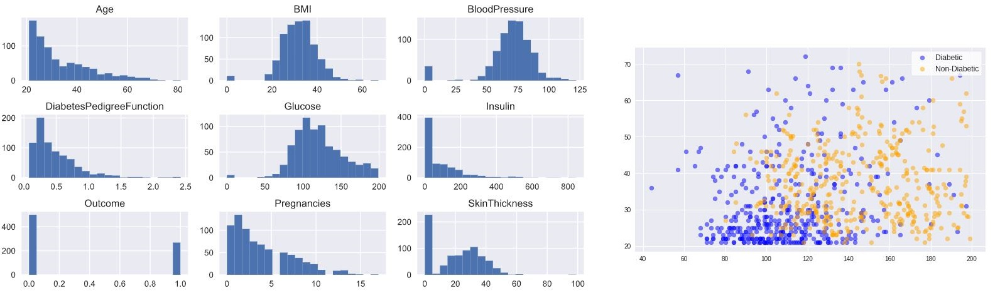

# Portfolio
---
## Data Science

### PIMA Indian Diabetes Prediction

The classic <a href="https://www.kaggle.com/uciml/pima-indians-diabetes-database"><i><b>PIMA Indian Diabetes data set</b></i></a>, but with a more in-depth approach. In this analysis, my goal is to explore the unbalanced binary class and find a method that makes my prediction more assertive. I compare some models with the original data to <b>Undersampling Majority Class</b>, <b>Oversampling Minority Class</b>, <b>SMOTE</b> and <b>SMOTE combined with Undersampling</b>.

---

© 2020 Walter Teixeira. Powered by Jekyll and the Minimal Theme.

