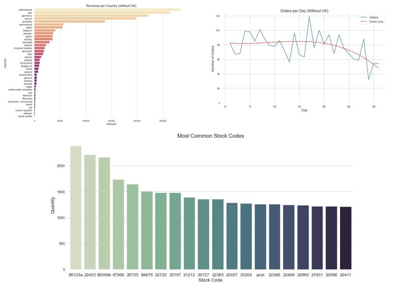
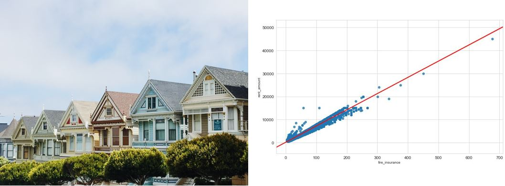

# Portfolio
---
## Data Science

### PIMA Indian Diabetes Prediction

The classic <a href="https://www.kaggle.com/uciml/pima-indians-diabetes-database"><i><b>PIMA Indian Diabetes data set</b></i></a>, but with a more in-depth approach. In this analysis, my goal is to explore the unbalanced binary class and find a method that makes my prediction more assertive. I compare some models with the original data to <b>Undersampling Majority Class</b>, <b>Oversampling Minority Class</b>, <b>SMOTE</b> and <b>SMOTE combined with Undersampling</b>.
 

---
### E-Commerce Data Analysis

This work is based on a data set of transnational sales from an UK-based non-store online retail. In this analysis, my goal is to explore the data, learn more about sales and find patterns.
 

<noscript></noscript><object class='tableauViz'  style='display:none;'><param name='host_url' value='https%3A%2F%2Fpublic.tableau.com%2F' /> <param name='embed_code_version' value='3' /> <param name='site_root' value='' /><param name='name' value='E-CommerceAnalysis_15978372527630&#47;SalesOverview' /><param name='tabs' value='no' /><param name='toolbar' value='yes' /><param name='static_image' value='https:&#47;&#47;public.tableau.com&#47;static&#47;images&#47;E-&#47;E-CommerceAnalysis_15978372527630&#47;SalesOverview&#47;1.png' /> <param name='animate_transition' value='yes' /><param name='display_static_image' value='yes' /><param name='display_spinner' value='yes' /><param name='display_overlay' value='yes' /><param name='display_count' value='yes' /><param name='language' value='pt' /><param name='filter' value='publish=yes' /></object>

---
### Houses for Rent

This data set is based on Brazilian houses for rent. It is a small project and the objective is to explore data, understand the relationship between features and rent and train models for rent forecasting.
 

---

© 2020 Walter Teixeira. Powered by Jekyll and the Minimal Theme.

